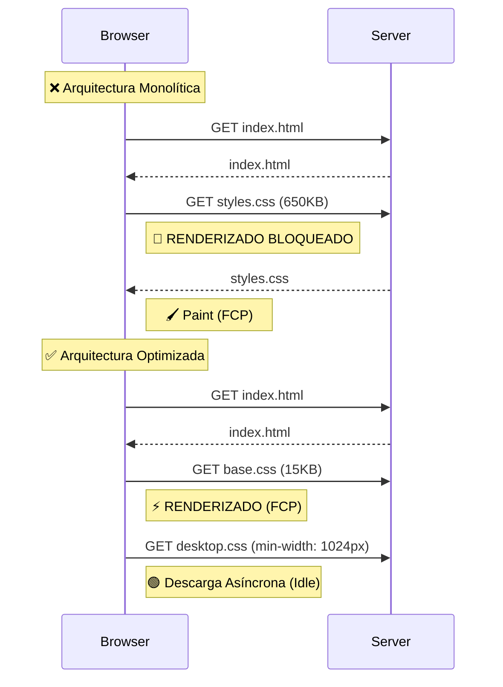

# 🎨 Arquitectura CSS de Alto Rendimiento: La Guía Definitiva de Media Queries

En el ecosistema del desarrollo web moderno, las **Media Queries** son frecuentemente malinterpretadas como herramientas exclusivas para el diseño visual y la maquetación responsiva. Sin embargo, para un Ingeniero de Performance, su función trasciende la estética: **son una de las estrategias más potentes para la orquestación de la entrega de recursos**.

El CSS no es inocuo. Es, por definición, un **Recurso que Bloquea el Renderizado (Render Blocking Resource)**. Comprender cómo manipular este comportamiento mediante la arquitectura adecuada es la diferencia entre una web que carga instantáneamente y una que lucha por aparecer en pantalla.

## 1. El Impacto del CSS en la Ruta Crítica de Renderizado

Para optimizar el *LCP (Largest Contentful Paint)*, primero debemos diseccionar por qué el CSS es un cuello de botella crítico.

### La Mecánica del Bloqueo 🛑

Cuando el navegador realiza el parseo del HTML y encuentra una etiqueta `<link rel="stylesheet">`, detiene inmediatamente el renderizado. El motor no pintará nada hasta que haya descargado y construido el **CSSOM (CSS Object Model)** completo.

> [!IMPORTANT]
> **El coste oculto:** Aunque tu CSS tenga reglas que solo apliquen a escritorio (`min-width: 1024px`), si están en un archivo bloqueante, el navegador móvil **descargará y parseará** esas reglas antes de pintar, consumiendo CPU y memoria innecesariamente.



### El Papel Clave del Atributo `media` en la Prioridad de Carga

El atributo `media` del elemento `<link>` no solo aplica estilos condicionalmente; **instruye al navegador sobre la prioridad de descarga**.

Si especificamos una media query que se evalúa como `false` en el momento de la carga (ej. `media="(min-width: 1024px)"` en un móvil), ocurren dos cosas fundamentales:

1.  **Desbloqueo del Renderizado**: El navegador sabe que estos estilos no son necesarios para el pintado inicial.
2.  **Ajuste de Prioridad**: La descarga se relega a **Prioridad Baja**, liberando ancho de banda.

## 2. Estrategia Práctica: Divide y Vencerás

La arquitectura de alto rendimiento se basa en dividir el CSS monolítico en archivos separados según su contexto de uso. No debemos enviar todo el CSS a todos los dispositivos en el primer paquete bloqueante.

### Segmentación por Archivos (File Splitting)

En lugar de un único `styles.css`, separamos los estilos base (globales) de los estilos específicos de viewport o impresión.

#### Ejemplo Específico de Reducción de Bloqueo

Imaginemos un sitio con **650 KB** de CSS. En una arquitectura monolítica, un móvil descarga los 650KB antes de pintar nada.

**Optimización:**
Dividimos la carga. Dejamos el CSS Crítico (que abordaremos en un futuro artículo) en el `head` y separamos el resto por dispositivo.

```html
<head>
  <!-- 1. CSS Crítico (Inline) -->
  <!-- (Tema pendiente para otro post: Aquí irían los estilos vitales para el primer renderizado) -->
  <style> /* ... critical styles ... */ </style>

  <!-- 2. Estrategia de División por Dispositivo -->
  
  <!-- mobile.css: Solo aplica a pantallas pequeñas (< 768px). -->
  <!-- En Desktop, este archivo se descarga con prioridad baja y NO bloquea. -->
  <link rel="stylesheet" href="mobile.css" media="(max-width: 767px)">

  <!-- desktop.css: Solo aplica a pantallas grandes (>= 768px). -->
  <!-- En Móvil, este archivo se descarga con prioridad baja y NO bloquea. -->
  <link rel="stylesheet" href="desktop.css" media="(min-width: 768px)">
</head>
```

> [!TIP]
> Al segregar mobile y desktop explícitamente, evitas que el usuario descargue y procese reglas css inútiles para su contexto actual en la ruta crítica.

## 3. Media Queries de Preferencia del Usuario (Performance UX)

La performance también es eficiencia de ejecución.

### `prefers-reduced-motion`
En lugar de simplemente "apagar" las animaciones, podemos ofrecer una experiencia alternativa más ligera para usuarios sensibles al movimiento.

```css
/* Animación estándar: Desplazamiento visible */
.card:hover {
  transform: translateY(-10px);
  transition: transform 0.3s ease;
}

@media (prefers-reduced-motion: reduce) {
  /* Alternativa "segura": Cambio sutil de color o borde, sin movimiento */
  .card:hover {
    transform: none;
    border-color: var(--primary-color);
    transition: border-color 0.1s linear;
  }
}
```
De esta forma, mantenemos el feedback visual (UX) sin causar mareos ni sobrecargar la GPU.

## 4. Auditoría: Chrome DevTools y CSS Overview

Para auditar tus Media Queries sin instalar nada extra, Chrome ofrece un panel dedicado.

### Usando el panel "CSS Overview" (Vista general del CSS)
Esta herramienta te da un resumen de alto nivel de tu CSS, incluyendo todas las media queries declaradas.

1.  Abre DevTools (`F12`).
2.  Haz clic en el menú de tres puntos (⋮) o el icono `>>` en la barra de pestañas de DevTools.
3.  Selecciona **"CSS Overview"** (o "Vista general del CSS").
4.  Haz clic en el botón **"Capture overview"**.


**¿Qué buscar?**
En la sección **Media queries**, verás un listado de todos los breakpoints. Si ves breakpoints complejos o redundantes, es una señal de que necesitas organizar mejor tus archivos. Además, te permite ver rápidamente si estás cargando lógica de escritorio en una vista móvil.

## 5. Automatización: PostCSS al Rescate

Hacer esta separación manualmente es tedioso y propenso a errores. Afortunadamente, podemos automatizarlo en nuestro proceso de build usando **PostCSS**.

### Plugin: `postcss-extract-media-query`

Este plugin extrae automáticamente las reglas dentro de `@media` y las guarda en archivos separados (`desktop.css`, `tablet.css`), dejando tu CSS base limpio.

**Configuración de ejemplo (`postcss.config.js`):**

```javascript
module.exports = {
  plugins: {
    'postcss-extract-media-query': {
      output: {
        path: 'dist/css',
        name: '[name]-[query].css'
      },
      queries: {
        'screen and (min-width: 1024px)': 'desktop',
        'print': 'print'
      }
    }
  }
}
```

Al compilar, obtendrás automáticamente tus archivos divididos y optimizados, listos para ser enlazados con su atributo `media` correspondiente.

---

## Conclusión

El atributo `media` es una herramienta de orquestación de carga. Mover reglas de CSS de un archivo bloqueante a uno condicional es una de las victorias de rendimiento más rápidas y efectivas que puedes implementar.

**Deja de enviar código muerto a tus usuarios móviles. Divide, carga condicionalmente y vencerás.**
